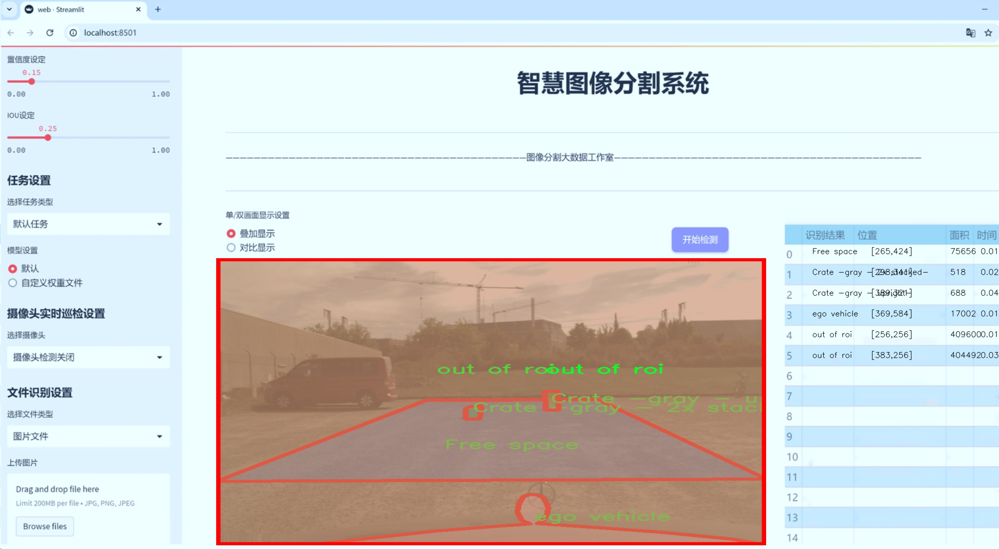
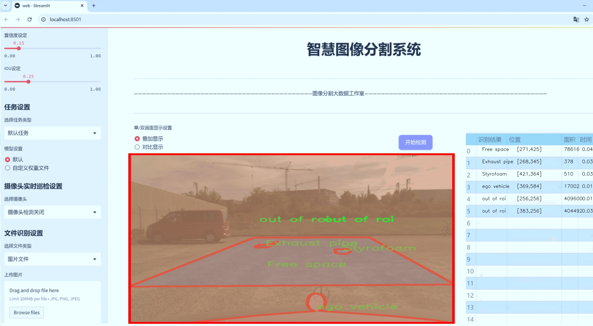
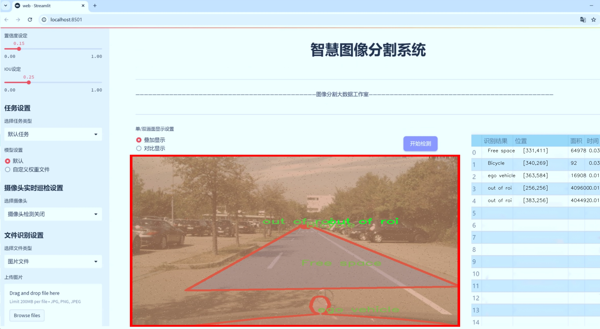
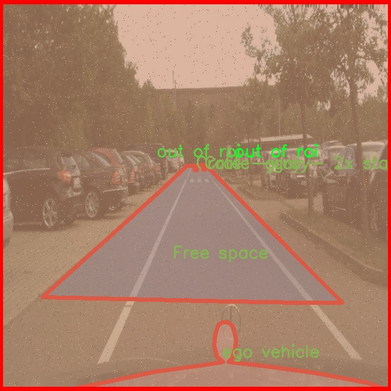
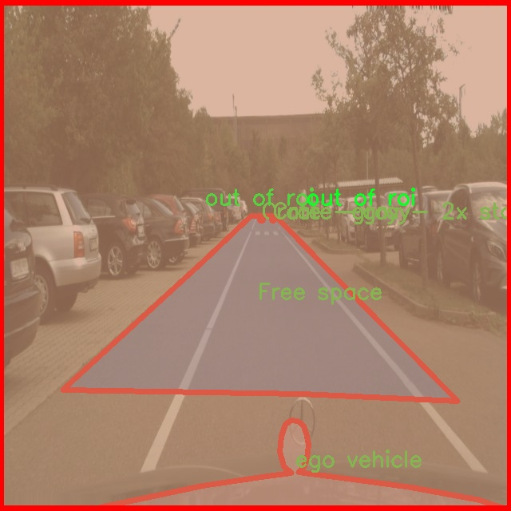
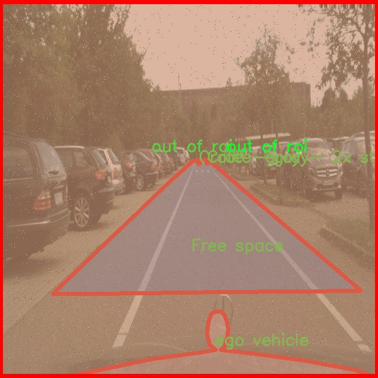
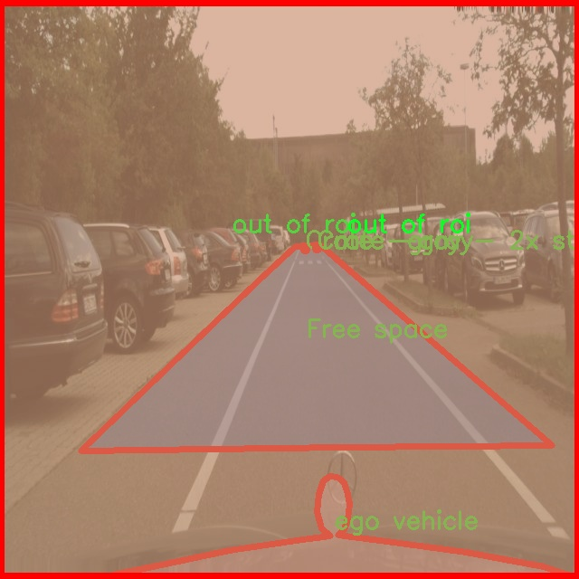
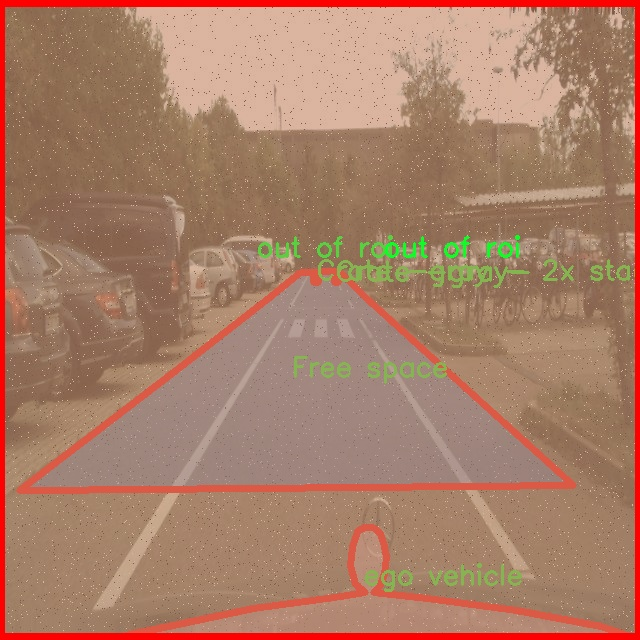

# 车道抛洒物识别图像分割系统： yolov8-seg

### 1.研究背景与意义

[参考博客](https://gitee.com/YOLOv8_YOLOv11_Segmentation_Studio/projects)

[博客来源](https://kdocs.cn/l/cszuIiCKVNis)

研究背景与意义

随着城市化进程的加快，交通运输的复杂性和多样性日益增加，车道抛洒物的识别与处理成为交通安全管理中的一项重要任务。车道抛洒物不仅影响交通流畅性，还可能导致交通事故，威胁到行车安全。因此，如何高效、准确地识别和分割车道上的抛洒物，成为了智能交通系统研究的热点之一。传统的图像处理方法在复杂环境下的表现往往不尽如人意，尤其是在动态场景中，物体的遮挡、光照变化和背景杂乱等因素使得抛洒物的识别变得更加困难。

近年来，深度学习技术的迅猛发展为图像识别和分割提供了新的解决方案。YOLO（You Only Look Once）系列模型因其高效的实时检测能力而受到广泛关注。YOLOv8作为该系列的最新版本，进一步提升了模型的精度和速度，尤其在复杂场景下的表现更为突出。然而，现有的YOLOv8模型在处理特定场景如车道抛洒物时，仍存在一定的局限性。因此，基于改进YOLOv8的车道抛洒物识别图像分割系统的研究具有重要的理论和实际意义。

本研究的核心在于利用“Lost And Found Segmentation”数据集，该数据集包含1000张图像，涵盖31类不同的抛洒物体，包括球、儿童玩具、纸箱、狗、轮胎等。这些类别的多样性为模型的训练提供了丰富的样本，有助于提高模型在实际应用中的泛化能力。此外，数据集中包含的多种物体形态和不同的背景环境，使得模型在面对复杂场景时，能够更好地进行分割和识别。这为交通管理部门提供了一个有效的工具，能够实时监测和识别车道上的潜在危险物体，从而及时采取措施，保障交通安全。

通过改进YOLOv8模型，我们可以在特征提取、模型结构和训练策略等方面进行创新，提升其在车道抛洒物识别中的表现。具体而言，采用多尺度特征融合技术，能够有效提高模型对不同大小物体的识别能力；而引入注意力机制，则有助于模型聚焦于关键区域，减少背景干扰，提高分割精度。此外，结合迁移学习的方法，可以利用预训练模型加速训练过程，提升模型的收敛速度和性能。

综上所述，基于改进YOLOv8的车道抛洒物识别图像分割系统的研究，不仅为智能交通系统的发展提供了新的思路和方法，也为城市交通管理的智能化、自动化提供了重要的技术支持。通过该系统的实施，可以有效提高交通安全管理的效率，降低交通事故的发生率，为构建安全、畅通的交通环境贡献力量。

### 2.图片演示







注意：本项目提供完整的训练源码数据集和训练教程,由于此博客编辑较早,暂不提供权重文件（best.pt）,需要按照6.训练教程进行训练后实现上图效果。

### 3.视频演示

[3.1 视频演示](https://www.bilibili.com/video/BV1NgUAYyEop/)

### 4.数据集信息

##### 4.1 数据集类别数＆类别名

nc: 31
names: ['Ball', 'Bicycle', 'Bobby car -gray-', 'Bobby car -red-', 'Bumper', 'Cardboard box', 'Cardboard box 2', 'Crate -black - 2x stacked-', 'Crate -black - upright-', 'Crate -black-', 'Crate -gray - 2x stacked-', 'Crate -gray - upright-', 'Crate -gray-', 'Dog -black-', 'Dog -white-', 'Euro pallet', 'Exhaust pipe', 'Free space', 'Headlight', 'Kid Dummy', 'Marker pole -lying-', 'Plastic bag -bloated-', 'Post -red - lying-', 'Post stand', 'Rearview mirror', 'Styrofoam', 'Timber -squared-', 'Tire', 'Wheel cap', 'ego vehicle', 'out of roi']


##### 4.2 数据集信息简介

数据集信息展示

在本研究中，我们采用了名为“Lost And Found Segmentation”的数据集，以训练和改进YOLOv8-seg模型，旨在实现高效的车道抛洒物识别图像分割系统。该数据集包含31个类别，涵盖了多种可能出现在道路上的物体，能够为模型提供丰富的训练样本，从而提高其在实际应用中的准确性和鲁棒性。

数据集中的类别包括了常见的交通物体和潜在的抛洒物，例如各种类型的球、儿童玩具、纸箱、木箱、狗、托盘、排气管等。这些类别的多样性不仅反映了现实交通环境中的复杂性，也为模型的学习提供了多维度的挑战。例如，球类和儿童玩具可能在不同的光照和天气条件下呈现出不同的外观，而纸箱和木箱则可能因为风吹或其他外力而发生位移，增加了识别的难度。

具体而言，数据集中包含的类别有：球、脚踏车、灰色和红色的儿童玩具车、缓冲器、纸箱（包括不同形状和颜色的变体）、各种类型的木箱、黑色和白色的狗、欧式托盘、排气管、空闲空间、车灯、儿童假人、标记杆、膨胀的塑料袋、红色躺着的柱子、柱子支架、后视镜、泡沫塑料、方木、轮胎、轮毂盖、自车以及“超出感兴趣区域”的物体。这些类别的选择充分考虑了道路环境中的常见障碍物和抛洒物，确保模型能够在多种情况下进行有效识别。

在数据集的构建过程中，图像样本的采集与标注是至关重要的。每个类别的图像均经过精心挑选，确保其在不同场景、角度和光照条件下的多样性。标注工作则采用了高精度的分割技术，以确保每个物体的边界清晰可辨，这对于后续的模型训练至关重要。通过这种方式，数据集不仅能够帮助模型学习到物体的外观特征，还能增强其对物体形状和位置变化的适应能力。

在训练过程中，YOLOv8-seg模型将利用“Lost And Found Segmentation”数据集中的图像和标注信息，通过深度学习算法不断优化其参数，以提高对车道抛洒物的识别精度。模型将学习如何在复杂的交通场景中准确分割出不同类别的物体，并在实时应用中快速响应，从而为道路安全和交通管理提供有效支持。

总之，“Lost And Found Segmentation”数据集为改进YOLOv8-seg的车道抛洒物识别图像分割系统提供了丰富的样本和多样的挑战，确保了模型在真实世界应用中的有效性和可靠性。通过对这一数据集的深入分析和应用，我们期望能够显著提升自动驾驶系统的智能化水平，为未来的智能交通系统奠定坚实的基础。











### 5.项目依赖环境部署教程（零基础手把手教学）

[5.1 环境部署教程链接（零基础手把手教学）](https://www.bilibili.com/video/BV1jG4Ve4E9t/?vd_source=bc9aec86d164b67a7004b996143742dc)


[5.2 安装Python虚拟环境创建和依赖库安装视频教程链接（零基础手把手教学）](https://www.bilibili.com/video/BV1nA4VeYEze/?vd_source=bc9aec86d164b67a7004b996143742dc)

### 6.手把手YOLOV8-seg训练视频教程（零基础手把手教学）

[6.1 手把手YOLOV8-seg训练视频教程（零基础小白有手就能学会）](https://www.bilibili.com/video/BV1cA4VeYETe/?vd_source=bc9aec86d164b67a7004b996143742dc)


按照上面的训练视频教程链接加载项目提供的数据集，运行train.py即可开始训练



     Epoch   gpu_mem       box       obj       cls    labels  img_size
     1/200     0G   0.01576   0.01955  0.007536        22      1280: 100%|██████████| 849/849 [14:42<00:00,  1.04s/it]
               Class     Images     Labels          P          R     mAP@.5 mAP@.5:.95: 100%|██████████| 213/213 [01:14<00:00,  2.87it/s]
                 all       3395      17314      0.994      0.957      0.0957      0.0843

     Epoch   gpu_mem       box       obj       cls    labels  img_size
     2/200     0G   0.01578   0.01923  0.007006        22      1280: 100%|██████████| 849/849 [14:44<00:00,  1.04s/it]
               Class     Images     Labels          P          R     mAP@.5 mAP@.5:.95: 100%|██████████| 213/213 [01:12<00:00,  2.95it/s]
                 all       3395      17314      0.996      0.956      0.0957      0.0845

     Epoch   gpu_mem       box       obj       cls    labels  img_size
     3/200     0G   0.01561    0.0191  0.006895        27      1280: 100%|██████████| 849/849 [10:56<00:00,  1.29it/s]
               Class     Images     Labels          P          R     mAP@.5 mAP@.5:.95: 100%|███████   | 187/213 [00:52<00:00,  4.04it/s]
                 all       3395      17314      0.996      0.957      0.0957      0.0845


### 7.50+种全套YOLOV8-seg创新点加载调参实验视频教程（一键加载写好的改进模型的配置文件）

[7.1 50+种全套YOLOV8-seg创新点加载调参实验视频教程（一键加载写好的改进模型的配置文件）](https://www.bilibili.com/video/BV1Hw4VePEXv/?vd_source=bc9aec86d164b67a7004b996143742dc)

### YOLOV8-seg算法简介

原始YOLOv8-seg算法原理

YOLOv8-seg算法是YOLO系列中最新的目标检测与分割算法，结合了YOLOv8的高效检测能力与图像分割的精细化处理，旨在实现更高精度的目标识别和像素级分割。相较于前一代YOLOv5，YOLOv8-seg在检测精度和速度上均有显著提升，展现出更强的适应性和灵活性，能够广泛应用于智能监控、自动驾驶、医学影像分析等多个领域。

YOLOv8-seg的网络结构主要由输入端、骨干网络、颈部网络和头部网络四个部分组成。输入端采用了马赛克数据增强、自适应锚框计算和自适应灰度填充等技术，以增强模型对不同场景的适应能力。马赛克数据增强通过将多张图像拼接在一起，生成多样化的训练样本，从而提高模型的鲁棒性和泛化能力。自适应锚框计算则通过分析训练数据的特征，动态调整锚框的尺寸和比例，以更好地适应目标物体的形状和大小。这些输入端的创新设计为后续的特征提取和处理奠定了坚实的基础。

在骨干网络部分，YOLOv8-seg引入了C2f模块和SPPF（Spatial Pyramid Pooling Fusion）结构。C2f模块是YOLOv8的核心特征提取单元，采用了更丰富的梯度流设计，通过多分支的跨层连接，显著增强了特征表示能力。这种设计使得模型能够更有效地学习到目标物体的细微特征，从而提高检测和分割的精度。同时，SPPF结构通过空间金字塔池化的方式，增强了模型对不同尺度目标的感知能力，使得YOLOv8-seg在处理复杂场景时表现得更加出色。

颈部网络采用了路径聚合网络（PAN）结构，旨在加强不同尺度特征的融合能力。PAN通过有效的特征传递和融合机制，确保了模型在处理多尺度目标时的高效性。该结构不仅提高了特征的表达能力，还优化了信息流动，使得模型能够更好地捕捉到目标物体的上下文信息，从而提升分割的准确性。

头部网络是YOLOv8-seg的关键部分，它将分类和检测过程进行解耦，采用了主流的解耦头结构。这一结构的设计使得分类和回归任务能够独立进行，从而减少了相互之间的干扰，提高了整体性能。在损失计算方面，YOLOv8-seg引入了Task-Aligned Assigner策略，根据分类与回归的分数加权结果选择正样本，确保了训练过程中的样本分配更加合理。损失计算涵盖了分类和回归两个分支，其中分类分支采用了二元交叉熵损失（BCELoss），而回归分支则结合了分布焦点损失（DFLoss）和完全交并比损失函数（CIOULoss），以提升模型对边界框预测的精准性。

与YOLOv5相比，YOLOv8-seg在多个方面进行了优化。首先，骨干网络的C3结构被更为高效的C2f结构所替代，这一变化不仅提升了特征提取的效率，还减少了模型的参数量，进一步实现了轻量化。其次，头部网络的解耦设计和无锚框检测头的引入，显著减少了锚框预测的数量，加速了非最大抑制（NMS）过程，从而提高了模型的实时性。

YOLOv8-seg还引入了多尺度训练和测试的策略，利用特征金字塔网络（FPN）和BiFPN网络，增强了模型对不同尺度特征信息的提取能力。这种双向跨尺度连接的设计，能够有效提升模型在处理复杂场景时的表现，使得YOLOv8-seg在实际应用中展现出更高的灵活性和适应性。

综上所述，YOLOv8-seg算法通过一系列创新设计和优化，成功实现了目标检测与分割的高效结合。其在精度和速度上的双重提升，使得YOLOv8-seg成为当前目标检测与分割领域中的一项重要技术。随着深度学习技术的不断发展，YOLOv8-seg无疑将在未来的应用中发挥更大的作用，为各类智能应用提供更为精准和高效的解决方案。


### 9.系统功能展示（检测对象为举例，实际内容以本项目数据集为准）

图9.1.系统支持检测结果表格显示

  图9.2.系统支持置信度和IOU阈值手动调节

  图9.3.系统支持自定义加载权重文件best.pt(需要你通过步骤5中训练获得)

  图9.4.系统支持摄像头实时识别

  图9.5.系统支持图片识别

  图9.6.系统支持视频识别

  图9.7.系统支持识别结果文件自动保存

  图9.8.系统支持Excel导出检测结果数据


### 10.50+种全套YOLOV8-seg创新点原理讲解（非科班也可以轻松写刊发刊，V11版本正在科研待更新）

#### 10.1 由于篇幅限制，每个创新点的具体原理讲解就不一一展开，具体见下列网址中的创新点对应子项目的技术原理博客网址【Blog】：


[10.1 50+种全套YOLOV8-seg创新点原理讲解链接](https://gitee.com/qunmasj/good)

#### 10.2 部分改进模块原理讲解(完整的改进原理见上图和技术博客链接)【如果此小节的图加载失败可以通过CSDN或者Github搜索该博客的标题访问原始博客，原始博客图片显示正常】
### YOLOv8简介
#### Neck模块设计
骨干网络和 Neck 的具体变化为：

第一个卷积层的 kernel 从 6x6 变成了 3x3
所有的 C3 模块换成 C2f，结构如下所示，可以发现多了更多的跳层连接和额外的 Split 操作


去掉了 Neck 模块中的 2 个卷积连接层
Backbone 中 C2f 的 block 数从 3-6-9-3 改成了 3-6-6-3
查看 N/S/M/L/X 等不同大小模型，可以发现 N/S 和 L/X 两组模型只是改了缩放系数，但是 S/M/L 等骨干网络的通道数设置不一样，没有遵循同一套缩放系数。如此设计的原因应该是同一套缩放系数下的通道设置不是最优设计，YOLOv7 网络设计时也没有遵循一套缩放系数作用于所有模型。

#### Head模块设计
Head 部分变化最大，从原先的耦合头变成了解耦头，并且从 YOLOv5 的 Anchor-Based 变成了 Anchor-Free。其结构如下所示：


可以看出，不再有之前的 objectness 分支，只有解耦的分类和回归分支，并且其回归分支使用了 Distribution Focal Loss 中提出的积分形式表示法。

#### Loss 计算
Loss 计算过程包括 2 个部分： 正负样本分配策略和 Loss 计算。 现代目标检测器大部分都会在正负样本分配策略上面做文章，典型的如 YOLOX 的 simOTA、TOOD 的 TaskAlignedAssigner 和 RTMDet 的 DynamicSoftLabelAssigner，这类 Assigner 大都是动态分配策略，而 YOLOv5 采用的依然是静态分配策略。考虑到动态分配策略的优异性，YOLOv8 算法中则直接引用了 TOOD 的 TaskAlignedAssigner。 TaskAlignedAssigner 的匹配策略简单总结为： 根据分类与回归的分数加权的分数选择正样本。

s 是标注类别对应的预测分值，u 是预测框和 gt 框的 iou，两者相乘就可以衡量对齐程度。

对于每一个 GT，对所有的预测框基于 GT 类别对应分类分数，预测框与 GT 的 IoU 的加权得到一个关联分类以及回归的对齐分数 alignment_metrics 。
对于每一个 GT，直接基于 alignment_metrics 对齐分数选取 topK 大的作为正样本
Loss 计算包括 2 个分支： 分类和回归分支，没有了之前的 objectness 分支。
分类分支依然采用 BCE Loss
回归分支需要和 Distribution Focal Loss 中提出的积分形式表示法绑定，因此使用了 Distribution Focal Loss， 同时还使用了 CIoU Loss
Loss 采用一定权重比例加权即可。
#### 训练数据增强
数据增强方面和 YOLOv5 差距不大，只不过引入了 YOLOX 中提出的最后 10 个 epoch 关闭 Mosaic 的操作。假设训练 epoch 是 500，其示意图如下所示：

### RCS-OSA的基本原理
参考该博客，RCSOSA（RCS-One-Shot Aggregation）是RCS-YOLO中提出的一种结构，我们可以将主要原理概括如下：

1. RCS（Reparameterized Convolution based on channel Shuffle）: 结合了通道混洗，通过重参数化卷积来增强网络的特征提取能力。

2. RCS模块: 在训练阶段，利用多分支结构学习丰富的特征表示；在推理阶段，通过结构化重参数化简化为单一分支，减少内存消耗。

3. OSA（One-Shot Aggregation）: 一次性聚合多个特征级联，减少网络计算负担，提高计算效率。

4. 特征级联: RCS-OSA模块通过堆叠RCS，确保特征的复用并加强不同层之间的信息流动。

#### RCS
RCS（基于通道Shuffle的重参数化卷积）是RCS-YOLO的核心组成部分，旨在训练阶段通过多分支结构学习丰富的特征信息，并在推理阶段通过简化为单分支结构来减少内存消耗，实现快速推理。此外，RCS利用通道分割和通道Shuffle操作来降低计算复杂性，同时保持通道间的信息交换，这样在推理阶段相比普通的3×3卷积可以减少一半的计算复杂度。通过结构重参数化，RCS能够在训练阶段从输入特征中学习深层表示，并在推理阶段实现快速推理，同时减少内存消耗。

#### RCS模块
RCS（基于通道Shuffle的重参数化卷积）模块中，结构在训练阶段使用多个分支，包括1x1和3x3的卷积，以及一个直接的连接（Identity），用于学习丰富的特征表示。在推理阶段，结构被重参数化成一个单一的3x3卷积，以减少计算复杂性和内存消耗，同时保持训练阶段学到的特征表达能力。这与RCS的设计理念紧密相连，即在不牺牲性能的情况下提高计算效率。


上图为大家展示了RCS的结构，分为训练阶段（a部分）和推理阶段（b部分）。在训练阶段，输入通过通道分割，一部分输入经过RepVGG块，另一部分保持不变。然后通过1x1卷积和3x3卷积处理RepVGG块的输出，与另一部分输入进行通道Shuffle和连接。在推理阶段，原来的多分支结构被简化为一个单一的3x3 RepConv块。这种设计允许在训练时学习复杂特征，在推理时减少计算复杂度。黑色边框的矩形代表特定的模块操作，渐变色的矩形代表张量的特定特征，矩形的宽度代表张量的通道数。 

#### OSA
OSA（One-Shot Aggregation）是一个关键的模块，旨在提高网络在处理密集连接时的效率。OSA模块通过表示具有多个感受野的多样化特征，并在最后的特征映射中仅聚合一次所有特征，从而克服了DenseNet中密集连接的低效率问题。

OSA模块的使用有两个主要目的：

1. 提高特征表示的多样性：OSA通过聚合具有不同感受野的特征来增加网络对于不同尺度的敏感性，这有助于提升模型对不同大小目标的检测能力。

2. 提高效率：通过在网络的最后一部分只进行一次特征聚合，OSA减少了重复的特征计算和存储需求，从而提高了网络的计算和能源效率。

在RCS-YOLO中，OSA模块被进一步与RCS（基于通道Shuffle的重参数化卷积）相结合，形成RCS-OSA模块。这种结合不仅保持了低成本的内存消耗，而且还实现了语义信息的有效提取，对于构建轻量级和大规模的对象检测器尤为重要。

下面我将为大家展示RCS-OSA（One-Shot Aggregation of RCS）的结构。


在RCS-OSA模块中，输入被分为两部分，一部分直接通过，另一部分通过堆叠的RCS模块进行处理。处理后的特征和直接通过的特征在通道混洗（Channel Shuffle）后合并。这种结构设计用于增强模型的特征提取和利用效率，是RCS-YOLO架构中的一个关键组成部分旨在通过一次性聚合来提高模型处理特征的能力，同时保持计算效率。

#### 特征级联
特征级联（feature cascade）是一种技术，通过在网络的一次性聚合（one-shot aggregate）路径上维持有限数量的特征级联来实现的。在RCS-YOLO中，特别是在RCS-OSA（RCS-Based One-Shot Aggregation）模块中，只保留了三个特征级联。

特征级联的目的是为了减轻网络计算负担并降低内存占用。这种方法可以有效地聚合不同层次的特征，提高模型的语义信息提取能力，同时避免了过度复杂化网络结构所带来的低效率和高资源消耗。

下面为大家提供的图像展示的是RCS-YOLO的整体架构，其中包括RCS-OSA模块。RCS-OSA在模型中用于堆叠RCS模块，以确保特征的复用并加强不同层之间的信息流动。图中显示的多层RCS-OSA模块的排列和组合反映了它们如何一起工作以优化特征传递和提高检测性能。


总结：RCS-YOLO主要由RCS-OSA（蓝色模块）和RepVGG（橙色模块）构成。这里的n代表堆叠RCS模块的数量。n_cls代表检测到的对象中的类别数量。图中的IDetect是从YOLOv7中借鉴过来的，表示使用二维卷积神经网络的检测层。这个架构通过堆叠的RCS模块和RepVGG模块，以及两种类型的检测层，实现了对象检测的任务。 


### 11.项目核心源码讲解（再也不用担心看不懂代码逻辑）

#### 11.1 ultralytics\nn\extra_modules\ops_dcnv3\functions\__init__.py

下面是对给定代码的核心部分进行分析和注释的结果：

```python
# --------------------------------------------------------
# InternImage
# Copyright (c) 2022 OpenGVLab
# Licensed under The MIT License [see LICENSE for details]
# --------------------------------------------------------

# 从当前包中导入DCNv3Function和dcnv3_core_pytorch模块
# DCNv3Function可能是一个自定义的深度可分离卷积（Deformable Convolution）函数，
# 而dcnv3_core_pytorch可能是与DCNv3相关的核心功能实现。
from .dcnv3_func import DCNv3Function, dcnv3_core_pytorch
```

### 注释说明：
1. **版权信息**：开头的版权信息表明该代码属于OpenGVLab，并且使用MIT许可证进行授权。
2. **模块导入**：使用相对导入的方式，从当前包（即同一目录下）导入了`DCNv3Function`和`dcnv3_core_pytorch`。这表明这些功能可能是该项目的核心组件，涉及到深度学习中的可变形卷积操作。
3. **功能说明**：
   - `DCNv3Function`：可能是实现了可变形卷积的函数，通常用于增强卷积神经网络的特征提取能力。
   - `dcnv3_core_pytorch`：可能是实现可变形卷积的核心功能，具体实现可能涉及PyTorch框架。

以上是对代码的核心部分及其功能的详细注释。

这个文件是一个Python模块的初始化文件，位于`ultralytics/nn/extra_modules/ops_dcnv3/functions/`目录下。文件的开头包含了一些版权信息，表明该代码属于OpenGVLab，并且是根据MIT许可证进行授权的。这意味着用户可以自由使用、修改和分发该代码，只要遵循MIT许可证的条款。

在文件的主体部分，代码通过`from`语句导入了两个对象：`DCNv3Function`和`dcnv3_core_pytorch`。这两个对象来自于同一目录下的`dcnv3_func`模块。通过这种方式，其他模块在导入这个包时，可以直接使用这两个对象，而不需要知道它们具体的实现细节。

`DCNv3Function`和`dcnv3_core_pytorch`很可能与深度学习中的某种特定操作或功能相关，特别是在计算机视觉领域。DCNv3（Deformable Convolutional Networks Version 3）是一种改进的可变形卷积网络，通常用于提高模型在处理复杂形状和变形物体时的表现。

总的来说，这个文件的主要作用是作为一个模块的入口点，简化了对内部功能的访问，使得使用者能够更方便地利用DCNv3相关的功能。

#### 11.2 ultralytics\models\rtdetr\predict.py

以下是代码中最核心的部分，并附上详细的中文注释：

```python
import torch
from ultralytics.data.augment import LetterBox
from ultralytics.engine.predictor import BasePredictor
from ultralytics.engine.results import Results
from ultralytics.utils import ops

class RTDETRPredictor(BasePredictor):
    """
    RT-DETR (Real-Time Detection Transformer) 预测器，扩展自 BasePredictor 类，用于使用百度的 RT-DETR 模型进行预测。

    该类利用视觉变换器的强大功能提供实时物体检测，同时保持高精度。它支持高效的混合编码和 IoU 感知查询选择等关键特性。
    """

    def postprocess(self, preds, img, orig_imgs):
        """
        对模型的原始预测结果进行后处理，以生成边界框和置信度分数。

        该方法根据置信度和类（如果在 `self.args` 中指定）过滤检测结果。

        参数:
            preds (torch.Tensor): 模型的原始预测结果。
            img (torch.Tensor): 处理后的输入图像。
            orig_imgs (list or torch.Tensor): 原始的未处理图像。

        返回:
            (list[Results]): 包含后处理边界框、置信度分数和类标签的 Results 对象列表。
        """
        # 获取预测结果的维度
        nd = preds[0].shape[-1]
        # 将预测结果分为边界框和分数
        bboxes, scores = preds[0].split((4, nd - 4), dim=-1)

        # 如果输入图像不是列表，则将其转换为 numpy 格式
        if not isinstance(orig_imgs, list):
            orig_imgs = ops.convert_torch2numpy_batch(orig_imgs)

        results = []
        # 遍历每个边界框
        for i, bbox in enumerate(bboxes):
            # 将边界框从 xywh 格式转换为 xyxy 格式
            bbox = ops.xywh2xyxy(bbox)
            # 获取每个边界框的最大分数和对应的类
            score, cls = scores[i].max(-1, keepdim=True)
            # 根据置信度阈值过滤
            idx = score.squeeze(-1) > self.args.conf
            # 如果指定了类，则进一步过滤
            if self.args.classes is not None:
                idx = (cls == torch.tensor(self.args.classes, device=cls.device)).any(1) & idx
            # 组合边界框、分数和类，并根据 idx 进行过滤
            pred = torch.cat([bbox, score, cls], dim=-1)[idx]
            orig_img = orig_imgs[i]
            oh, ow = orig_img.shape[:2]
            # 将边界框坐标调整为原始图像的大小
            pred[..., [0, 2]] *= ow
            pred[..., [1, 3]] *= oh
            img_path = self.batch[0][i]
            # 将结果添加到列表中
            results.append(Results(orig_img, path=img_path, names=self.model.names, boxes=pred))
        return results

    def pre_transform(self, im):
        """
        在将输入图像送入模型进行推理之前，对其进行预处理。输入图像被调整为方形比例并填充。

        参数:
            im (list[np.ndarray] | torch.Tensor): 输入图像，形状为 (N,3,h,w) 的张量，或 [(h,w,3) x N] 的列表。

        返回:
            (list): 预处理后的图像列表，准备进行模型推理。
        """
        # 创建 LetterBox 对象以进行图像预处理
        letterbox = LetterBox(self.imgsz, auto=False, scaleFill=True)
        # 对每个图像进行预处理
        return [letterbox(image=x) for x in im]
```

### 代码核心部分说明：
1. **RTDETRPredictor 类**：该类继承自 `BasePredictor`，用于实现实时物体检测的功能。
2. **postprocess 方法**：该方法对模型的原始预测结果进行后处理，生成边界框和置信度分数，并根据设定的阈值和类进行过滤。
3. **pre_transform 方法**：该方法对输入图像进行预处理，以确保图像符合模型输入要求（方形且填充）。

这个程序文件 `ultralytics\models\rtdetr\predict.py` 实现了一个名为 `RTDETRPredictor` 的类，主要用于基于百度的 RT-DETR 模型进行实时目标检测。该类继承自 `BasePredictor`，利用视觉变换器的优势，在保持高精度的同时实现高效的实时目标检测。该预测器支持高效的混合编码和 IoU（Intersection over Union）感知查询选择等关键特性。

在类的文档字符串中，提供了使用示例，展示了如何通过指定模型和数据源来创建预测器实例，并调用 `predict_cli` 方法进行预测。

类中定义了两个主要方法：`postprocess` 和 `pre_transform`。

`postprocess` 方法用于对模型的原始预测结果进行后处理，以生成边界框和置信度分数。该方法首先将预测结果分割为边界框和分数，然后根据置信度和类别进行过滤。它接收三个参数：`preds`（模型的原始预测结果）、`img`（处理后的输入图像）和 `orig_imgs`（原始未处理的图像）。处理后，返回一个包含后处理结果的 `Results` 对象列表。

在 `postprocess` 方法中，首先获取预测结果的维度，然后将边界框和分数分开。接着，如果输入图像不是列表格式，则将其转换为 NumPy 格式。随后，遍历每个边界框，使用 `xywh2xyxy` 方法将边界框坐标转换为适合绘制的格式，并根据置信度和类别进行过滤。最后，将处理后的结果与原始图像结合，创建 `Results` 对象并返回。

`pre_transform` 方法用于在将输入图像传递给模型进行推理之前，对其进行预处理。该方法使用 `LetterBox` 类将输入图像调整为正方形，并确保填充比例正确。它接收一个参数 `im`，可以是一个图像列表或张量，返回一个经过预处理的图像列表，准备好进行模型推理。

整体而言，这个文件的主要功能是实现一个高效的目标检测预测器，能够处理输入图像并输出检测结果，适用于实时应用场景。

#### 11.3 ultralytics\models\yolo\classify\__init__.py

```python
# 导入Ultralytics YOLO库中的分类模块
# Ultralytics YOLO 🚀, AGPL-3.0 许可证

# 从yolo分类模块中导入预测、训练和验证的类
from ultralytics.models.yolo.classify.predict import ClassificationPredictor  # 导入分类预测器
from ultralytics.models.yolo.classify.train import ClassificationTrainer      # 导入分类训练器
from ultralytics.models.yolo.classify.val import ClassificationValidator      # 导入分类验证器

# 定义模块的公开接口，包含分类预测器、训练器和验证器
__all__ = 'ClassificationPredictor', 'ClassificationTrainer', 'ClassificationValidator'
```

### 代码核心部分及注释：
1. **导入模块**：
   - 通过`from ... import ...`语句导入YOLO模型中的分类相关功能，包括预测、训练和验证。这些功能是实现图像分类任务的关键。

2. **定义公开接口**：
   - `__all__`变量用于定义当使用`from module import *`时，哪些名称是可以被导入的。这里包含了三个核心类，分别用于分类预测、训练和验证，确保用户能够方便地使用这些功能。

这个程序文件是Ultralytics YOLO（You Only Look Once）项目的一部分，主要用于图像分类的功能模块。文件的第一行是一个注释，表明该项目使用的是AGPL-3.0许可证，说明了其开源性质和使用条款。

接下来的几行代码通过`from`语句导入了三个类：`ClassificationPredictor`、`ClassificationTrainer`和`ClassificationValidator`。这些类分别用于图像分类的不同任务。具体来说，`ClassificationPredictor`用于进行分类预测，`ClassificationTrainer`用于训练分类模型，而`ClassificationValidator`则用于验证模型的性能。

最后，`__all__`变量定义了该模块的公共接口，列出了可以被外部访问的类。这意味着当其他模块使用`from ultralytics.models.yolo.classify import *`时，只会导入`ClassificationPredictor`、`ClassificationTrainer`和`ClassificationValidator`这三个类，而不会导入其他未列出的内容。

总的来说，这个文件的主要功能是组织和暴露与YOLO图像分类相关的类，方便其他模块或用户进行调用和使用。

#### 11.4 ultralytics\nn\backbone\lsknet.py

以下是经过简化和注释的核心代码部分：

```python
import torch
import torch.nn as nn
from torch.nn.modules.utils import _pair as to_2tuple
from functools import partial

# 定义 Mlp 类，用于实现多层感知机结构
class Mlp(nn.Module):
    def __init__(self, in_features, hidden_features=None, out_features=None, act_layer=nn.GELU, drop=0.):
        super().__init__()
        out_features = out_features or in_features  # 输出特征数默认为输入特征数
        hidden_features = hidden_features or in_features  # 隐藏层特征数默认为输入特征数
        self.fc1 = nn.Conv2d(in_features, hidden_features, 1)  # 第一层卷积
        self.dwconv = DWConv(hidden_features)  # 深度卷积
        self.act = act_layer()  # 激活函数
        self.fc2 = nn.Conv2d(hidden_features, out_features, 1)  # 第二层卷积
        self.drop = nn.Dropout(drop)  # Dropout层

    def forward(self, x):
        x = self.fc1(x)  # 通过第一层卷积
        x = self.dwconv(x)  # 通过深度卷积
        x = self.act(x)  # 激活
        x = self.drop(x)  # Dropout
        x = self.fc2(x)  # 通过第二层卷积
        x = self.drop(x)  # Dropout
        return x

# 定义 LSKblock 类，用于实现特定的块结构
class LSKblock(nn.Module):
    def __init__(self, dim):
        super().__init__()
        self.conv0 = nn.Conv2d(dim, dim, 5, padding=2, groups=dim)  # 深度卷积
        self.conv_spatial = nn.Conv2d(dim, dim, 7, stride=1, padding=9, groups=dim, dilation=3)  # 空间卷积
        self.conv1 = nn.Conv2d(dim, dim//2, 1)  # 1x1卷积
        self.conv2 = nn.Conv2d(dim, dim//2, 1)  # 1x1卷积
        self.conv_squeeze = nn.Conv2d(2, 2, 7, padding=3)  # 压缩卷积
        self.conv = nn.Conv2d(dim//2, dim, 1)  # 1x1卷积

    def forward(self, x):   
        attn1 = self.conv0(x)  # 通过深度卷积
        attn2 = self.conv_spatial(attn1)  # 通过空间卷积

        attn1 = self.conv1(attn1)  # 通过1x1卷积
        attn2 = self.conv2(attn2)  # 通过1x1卷积
        
        attn = torch.cat([attn1, attn2], dim=1)  # 拼接
        avg_attn = torch.mean(attn, dim=1, keepdim=True)  # 平均注意力
        max_attn, _ = torch.max(attn, dim=1, keepdim=True)  # 最大注意力
        agg = torch.cat([avg_attn, max_attn], dim=1)  # 拼接平均和最大注意力
        sig = self.conv_squeeze(agg).sigmoid()  # 通过压缩卷积并激活
        attn = attn1 * sig[:,0,:,:].unsqueeze(1) + attn2 * sig[:,1,:,:].unsqueeze(1)  # 加权
        attn = self.conv(attn)  # 通过1x1卷积
        return x * attn  # 返回加权后的输入

# 定义 Attention 类，包含注意力机制
class Attention(nn.Module):
    def __init__(self, d_model):
        super().__init__()
        self.proj_1 = nn.Conv2d(d_model, d_model, 1)  # 投影层
        self.activation = nn.GELU()  # 激活函数
        self.spatial_gating_unit = LSKblock(d_model)  # 空间门控单元
        self.proj_2 = nn.Conv2d(d_model, d_model, 1)  # 投影层

    def forward(self, x):
        shortcut = x.clone()  # 保存输入
        x = self.proj_1(x)  # 通过投影层
        x = self.activation(x)  # 激活
        x = self.spatial_gating_unit(x)  # 通过空间门控单元
        x = self.proj_2(x)  # 通过投影层
        x = x + shortcut  # 残差连接
        return x

# 定义 LSKNet 类，整体网络结构
class LSKNet(nn.Module):
    def __init__(self, img_size=224, in_chans=3, embed_dims=[64, 128, 256, 512],
                 mlp_ratios=[8, 8, 4, 4], drop_rate=0., drop_path_rate=0., 
                 norm_layer=partial(nn.LayerNorm, eps=1e-6), depths=[3, 4, 6, 3], 
                 num_stages=4):
        super().__init__()
        
        self.depths = depths  # 各阶段的深度
        self.num_stages = num_stages  # 阶段数

        # 随机深度衰减规则
        dpr = [x.item() for x in torch.linspace(0, drop_path_rate, sum(depths))]
        cur = 0

        # 初始化每个阶段的嵌入和块
        for i in range(num_stages):
            patch_embed = OverlapPatchEmbed(img_size=img_size if i == 0 else img_size // (2 ** (i + 1)),
                                            patch_size=7 if i == 0 else 3,
                                            stride=4 if i == 0 else 2,
                                            in_chans=in_chans if i == 0 else embed_dims[i - 1],
                                            embed_dim=embed_dims[i])
            block = nn.ModuleList([Block(
                dim=embed_dims[i], mlp_ratio=mlp_ratios[i], drop=drop_rate, drop_path=dpr[cur + j])
                for j in range(depths[i])])
            norm = norm_layer(embed_dims[i])  # 归一化层
            cur += depths[i]

            setattr(self, f"patch_embed{i + 1}", patch_embed)  # 设置嵌入层
            setattr(self, f"block{i + 1}", block)  # 设置块
            setattr(self, f"norm{i + 1}", norm)  # 设置归一化层

    def forward(self, x):
        B = x.shape[0]  # 批量大小
        outs = []  # 输出列表
        for i in range(self.num_stages):
            patch_embed = getattr(self, f"patch_embed{i + 1}")  # 获取嵌入层
            block = getattr(self, f"block{i + 1}")  # 获取块
            norm = getattr(self, f"norm{i + 1}")  # 获取归一化层
            x, H, W = patch_embed(x)  # 嵌入
            for blk in block:
                x = blk(x)  # 通过块
            x = x.flatten(2).transpose(1, 2)  # 展平并转置
            x = norm(x)  # 归一化
            x = x.reshape(B, H, W, -1).permute(0, 3, 1, 2).contiguous()  # 重塑形状
            outs.append(x)  # 添加到输出列表
        return outs  # 返回所有阶段的输出

# 定义 DWConv 类，深度卷积
class DWConv(nn.Module):
    def __init__(self, dim=768):
        super(DWConv, self).__init__()
        self.dwconv = nn.Conv2d(dim, dim, 3, 1, 1, bias=True, groups=dim)  # 深度卷积

    def forward(self, x):
        x = self.dwconv(x)  # 通过深度卷积
        return x

# 定义 lsknet_t 函数，创建 LSKNet 模型
def lsknet_t(weights=''):
    model = LSKNet(embed_dims=[32, 64, 160, 256], depths=[3, 3, 5, 2], drop_rate=0.1, drop_path_rate=0.1)
    if weights:
        model.load_state_dict(torch.load(weights)['state_dict'])  # 加载权重
    return model

# 定义 lsknet_s 函数，创建 LSKNet 模型
def lsknet_s(weights=''):
    model = LSKNet(embed_dims=[64, 128, 256, 512], depths=[2, 2, 4, 2], drop_rate=0.1, drop_path_rate=0.1)
    if weights:
        model.load_state_dict(torch.load(weights)['state_dict'])  # 加载权重
    return model

# 主程序入口
if __name__ == '__main__':
    model = lsknet_t('lsk_t_backbone-2ef8a593.pth')  # 创建模型并加载权重
    inputs = torch.randn((1, 3, 640, 640))  # 创建随机输入
    for i in model(inputs):  # 通过模型
        print(i.size())  # 输出每个阶段的输出尺寸
```

### 代码说明：
1. **Mlp 类**：实现了一个多层感知机，包含两个卷积层和一个深度卷积层。
2. **LSKblock 类**：实现了一个特定的块结构，使用深度卷积和空间卷积进行特征提取。
3. **Attention 类**：实现了一个注意力机制，结合了残差连接。
4. **LSKNet 类**：整体网络结构，包含多个阶段，每个阶段由嵌入层、块和归一化层组成。
5. **DWConv 类**：实现了深度卷积。
6. **lsknet_t 和 lsknet_s 函数**：用于创建 LSKNet 模型并加载预训练权重。
7. **主程序**：创建模型实例并测试输入的输出尺寸。

这个程序文件定义了一个名为 `lsknet.py` 的深度学习模型，主要用于图像处理任务。该模型的结构基于一种新的网络架构，包含多个模块和层，旨在提高特征提取的效率和效果。

首先，程序导入了必要的库，包括 PyTorch 和一些特定的模块。`Mlp` 类定义了一个多层感知机结构，包含两个卷积层和一个深度卷积层（`DWConv`），并使用 GELU 激活函数和 Dropout 层来防止过拟合。

接下来，`LSKblock` 类实现了一个特定的块结构，使用了深度可分离卷积和空间卷积，结合了平均池化和最大池化的结果，生成一个注意力机制的输出。这个模块的输出通过与输入相乘来增强特征。

`Attention` 类则是一个注意力机制的实现，它通过对输入进行线性变换和激活，然后通过 `LSKblock` 进行处理，最后将结果与输入相加，以实现残差连接。

`Block` 类结合了归一化层、注意力机制和多层感知机，形成了一个完整的处理单元。它使用了随机深度（DropPath）技术来增强模型的泛化能力。

`OverlapPatchEmbed` 类负责将输入图像转换为补丁嵌入，使用卷积层来实现这一过程，并对嵌入结果进行归一化。

`LSKNet` 类是整个网络的核心，包含多个阶段（stages），每个阶段由补丁嵌入、多个块和归一化层组成。网络的深度和宽度可以通过参数进行调整。模型的前向传播方法处理输入数据并返回多个阶段的输出。

`DWConv` 类实现了深度卷积操作，进一步增强了特征提取的能力。

`update_weight` 函数用于更新模型的权重，确保加载的权重与模型的结构相匹配。

最后，`lsknet_t` 和 `lsknet_s` 函数分别定义了两种不同配置的 LSKNet 模型，并支持加载预训练权重。程序的主入口部分创建了一个 LSKNet 模型实例，并通过随机生成的输入数据测试模型的输出尺寸。

整体来看，这个程序实现了一个复杂的神经网络结构，旨在通过不同的模块和层来提高图像特征提取的能力，适用于计算机视觉领域的各种任务。

#### 11.5 ultralytics\models\yolo\__init__.py

以下是代码中最核心的部分，并附上详细的中文注释：

```python
# 导入Ultralytics YOLO模型的相关功能
from ultralytics.models.yolo import classify, detect, pose, segment

# 从当前模块导入YOLO类
from .model import YOLO

# 定义模块的公开接口，包含分类、检测、姿态估计、分割功能和YOLO类
__all__ = 'classify', 'segment', 'detect', 'pose', 'YOLO'
```

### 详细注释：

1. `from ultralytics.models.yolo import classify, detect, pose, segment`：
   - 从`ultralytics`库中的`models.yolo`模块导入四个主要功能：
     - `classify`：用于图像分类的功能。
     - `detect`：用于目标检测的功能。
     - `pose`：用于姿态估计的功能。
     - `segment`：用于图像分割的功能。

2. `from .model import YOLO`：
   - 从当前模块的`model`文件中导入`YOLO`类。这个类通常是YOLO模型的实现，负责模型的初始化和推理等功能。

3. `__all__ = 'classify', 'segment', 'detect', 'pose', 'YOLO'`：
   - 定义模块的公开接口，指定当使用`from module import *`时，哪些名称是可以被导入的。这有助于控制模块的命名空间，避免不必要的名称冲突。

这个程序文件是Ultralytics YOLO模型的初始化文件，文件名为`__init__.py`，它的主要作用是定义该模块的公共接口以及导入相关的功能。

首先，文件顶部的注释表明这是Ultralytics YOLO项目的一部分，并且使用的是AGPL-3.0许可证，这意味着该代码是开源的，并且遵循特定的使用和分发条款。

接下来，文件通过`from`语句导入了四个功能模块：`classify`、`detect`、`pose`和`segment`，这些模块分别对应于YOLO模型的不同应用场景。具体来说，`classify`用于分类任务，`detect`用于目标检测，`pose`用于姿态估计，而`segment`则用于图像分割。这些功能模块使得用户可以根据需要调用不同的YOLO模型功能。

然后，文件还从当前目录下的`model`模块中导入了`YOLO`类，这个类可能是YOLO模型的核心实现，负责模型的构建和推理。

最后，`__all__`变量被定义为一个元组，包含了字符串`'classify'`、`'segment'`、`'detect'`、`'pose'`和`'YOLO'`。这个变量的作用是指明当使用`from ultralytics.models.yolo import *`语句时，哪些名称会被导入。这是一种控制模块公共接口的方式，确保用户只访问到预期的功能。

总的来说，这个文件的主要功能是组织和暴露YOLO模型的不同功能模块，使得用户可以方便地使用这些功能进行各种计算机视觉任务。

### 12.系统整体结构（节选）

### 整体功能和构架概括

Ultralytics项目是一个用于计算机视觉任务的深度学习框架，特别专注于目标检测、图像分类、姿态估计和图像分割等应用。该项目的架构模块化，允许用户根据需求选择和使用不同的模型和功能。各个模块之间通过清晰的接口进行交互，增强了代码的可维护性和可扩展性。

1. **`ultralytics\nn\extra_modules\ops_dcnv3\functions\__init__.py`**: 该文件用于初始化DCNv3模块，导入与可变形卷积相关的功能，简化了用户对该模块的访问。
  
2. **`ultralytics\models\rtdetr\predict.py`**: 实现了实时目标检测的预测器，支持图像的预处理和后处理，提供了高效的推理能力。

3. **`ultralytics\models\yolo\classify\__init__.py`**: 组织和暴露YOLO图像分类相关的类，方便用户进行分类任务的调用。

4. **`ultralytics\nn\backbone\lsknet.py`**: 定义了LSKNet模型，提供了一种新的网络架构用于特征提取，适用于各种图像处理任务。

5. **`ultralytics\models\yolo\__init__.py`**: 初始化YOLO模块，导入与YOLO相关的功能模块，构建了YOLO模型的公共接口。

### 文件功能整理表

| 文件路径                                           | 功能描述                                               |
|---------------------------------------------------|--------------------------------------------------------|
| `ultralytics\nn\extra_modules\ops_dcnv3\functions\__init__.py` | 初始化DCNv3模块，导入相关功能以支持可变形卷积操作。      |
| `ultralytics\models\rtdetr\predict.py`           | 实现实时目标检测的预测器，处理图像的预处理和后处理。     |
| `ultralytics\models\yolo\classify\__init__.py`   | 组织和暴露YOLO图像分类相关的类，方便分类任务的调用。     |
| `ultralytics\nn\backbone\lsknet.py`              | 定义LSKNet模型，提供新的网络架构用于特征提取。           |
| `ultralytics\models\yolo\__init__.py`            | 初始化YOLO模块，导入与YOLO相关的功能模块，构建公共接口。 |

这个表格总结了每个文件的主要功能，帮助理解Ultralytics项目的整体结构和模块化设计。

### 13.图片、视频、摄像头图像分割Demo(去除WebUI)代码

在这个博客小节中，我们将讨论如何在不使用WebUI的情况下，实现图像分割模型的使用。本项目代码已经优化整合，方便用户将分割功能嵌入自己的项目中。
核心功能包括图片、视频、摄像头图像的分割，ROI区域的轮廓提取、类别分类、周长计算、面积计算、圆度计算以及颜色提取等。
这些功能提供了良好的二次开发基础。

### 核心代码解读

以下是主要代码片段，我们会为每一块代码进行详细的批注解释：

```python
import random
import cv2
import numpy as np
from PIL import ImageFont, ImageDraw, Image
from hashlib import md5
from model import Web_Detector
from chinese_name_list import Label_list

# 根据名称生成颜色
def generate_color_based_on_name(name):
    ......

# 计算多边形面积
def calculate_polygon_area(points):
    return cv2.contourArea(points.astype(np.float32))

...
# 绘制中文标签
def draw_with_chinese(image, text, position, font_size=20, color=(255, 0, 0)):
    image_pil = Image.fromarray(cv2.cvtColor(image, cv2.COLOR_BGR2RGB))
    draw = ImageDraw.Draw(image_pil)
    font = ImageFont.truetype("simsun.ttc", font_size, encoding="unic")
    draw.text(position, text, font=font, fill=color)
    return cv2.cvtColor(np.array(image_pil), cv2.COLOR_RGB2BGR)

# 动态调整参数
def adjust_parameter(image_size, base_size=1000):
    max_size = max(image_size)
    return max_size / base_size

# 绘制检测结果
def draw_detections(image, info, alpha=0.2):
    name, bbox, conf, cls_id, mask = info['class_name'], info['bbox'], info['score'], info['class_id'], info['mask']
    adjust_param = adjust_parameter(image.shape[:2])
    spacing = int(20 * adjust_param)

    if mask is None:
        x1, y1, x2, y2 = bbox
        aim_frame_area = (x2 - x1) * (y2 - y1)
        cv2.rectangle(image, (x1, y1), (x2, y2), color=(0, 0, 255), thickness=int(3 * adjust_param))
        image = draw_with_chinese(image, name, (x1, y1 - int(30 * adjust_param)), font_size=int(35 * adjust_param))
        y_offset = int(50 * adjust_param)  # 类别名称上方绘制，其下方留出空间
    else:
        mask_points = np.concatenate(mask)
        aim_frame_area = calculate_polygon_area(mask_points)
        mask_color = generate_color_based_on_name(name)
        try:
            overlay = image.copy()
            cv2.fillPoly(overlay, [mask_points.astype(np.int32)], mask_color)
            image = cv2.addWeighted(overlay, 0.3, image, 0.7, 0)
            cv2.drawContours(image, [mask_points.astype(np.int32)], -1, (0, 0, 255), thickness=int(8 * adjust_param))

            # 计算面积、周长、圆度
            area = cv2.contourArea(mask_points.astype(np.int32))
            perimeter = cv2.arcLength(mask_points.astype(np.int32), True)
            ......

            # 计算色彩
            mask = np.zeros(image.shape[:2], dtype=np.uint8)
            cv2.drawContours(mask, [mask_points.astype(np.int32)], -1, 255, -1)
            color_points = cv2.findNonZero(mask)
            ......

            # 绘制类别名称
            x, y = np.min(mask_points, axis=0).astype(int)
            image = draw_with_chinese(image, name, (x, y - int(30 * adjust_param)), font_size=int(35 * adjust_param))
            y_offset = int(50 * adjust_param)

            # 绘制面积、周长、圆度和色彩值
            metrics = [("Area", area), ("Perimeter", perimeter), ("Circularity", circularity), ("Color", color_str)]
            for idx, (metric_name, metric_value) in enumerate(metrics):
                ......

    return image, aim_frame_area

# 处理每帧图像
def process_frame(model, image):
    pre_img = model.preprocess(image)
    pred = model.predict(pre_img)
    det = pred[0] if det is not None and len(det)
    if det:
        det_info = model.postprocess(pred)
        for info in det_info:
            image, _ = draw_detections(image, info)
    return image

if __name__ == "__main__":
    cls_name = Label_list
    model = Web_Detector()
    model.load_model("./weights/yolov8s-seg.pt")

    # 摄像头实时处理
    cap = cv2.VideoCapture(0)
    while cap.isOpened():
        ret, frame = cap.read()
        if not ret:
            break
        ......

    # 图片处理
    image_path = './icon/OIP.jpg'
    image = cv2.imread(image_path)
    if image is not None:
        processed_image = process_frame(model, image)
        ......

    # 视频处理
    video_path = ''  # 输入视频的路径
    cap = cv2.VideoCapture(video_path)
    while cap.isOpened():
        ret, frame = cap.read()
        ......
```


### 14.完整训练+Web前端界面+50+种创新点源码、数据集获取


# [下载链接：https://mbd.pub/o/bread/Z5Wblphq](https://mbd.pub/o/bread/Z5Wblphq)